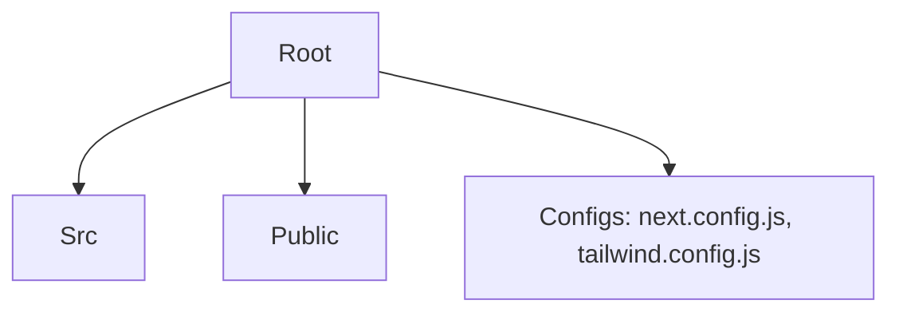

# Comprehensive Next.js Guide

A complete reference merging the best practices for Next.js App Router development, including installation, routing, data fetching, and performance optimization.

---

## 🛠️ Setup & Installation

### Initialize Project
```bash
# Standard interactive setup
npx create-next-app@latest

# Quick setup with TypeScript (Recommended)
npx create-next-app@latest my-app --typescript
```

### Install Essential Packages
```bash
# Core dependencies (usually pre-installed)
pnpm add next react react-dom

# Development utilities
pnpm add -D typescript @types/react @types/node

# Common utilities
pnpm add axios date-fns clsx search-query-params
```

### Run Development Server
```bash
npm run dev
# or
pnpm dev
```

---

## 📂 App Router Structure
Next.js use a file-system based router inside the `app/` directory.

### Page Creation
*   **Route**: `app/about/page.tsx` → `/about`
*   **Dynamic Route**: `app/posts/[id]/page.tsx` → `/posts/123`
*   **Route Group**: `app/(auth)/login/page.tsx` → `/login` (Folder name in `()` is skipped in URL)

### Layouts
*   **Root Layout**: `app/layout.tsx` (Required, contains `<html>` and `<body>`)
*   **Nested Layout**: `app/dashboard/layout.tsx` (Wraps all dashboard pages)

---

## 🧩 Components

### 🖥️ Server Components (Default)
*   Rendered on the server.
*   **No** browser interactivity (`onClick`, `useState`).
*   **Direct** database access allowed.
*   Async components supported (can `await` data).

### 🌐 Client Components
*   Must add `"use client"` directive at the top.
*   Rendered on server (hydration) + interactive on client.
*   Use standard React hooks (`useState`, `useEffect`).

```tsx
"use client";
import { useState } from "react";

export default function Counter() {
  const [count, setCount] = useState(0);
  return <button onClick={() => setCount(c => c+1)}>{count}</button>;
}
```

---

## 🧠 Data Fetching & Caching

### 1. Server-Side Rendering (SSR)
Fetches data on **every request**.
```ts
const res = await fetch('https://api.example.com/data', { cache: 'no-store' });
```

### 2. Static Site Generation (SSG)
Fetches data at **build time** (default behavior).
```ts
const res = await fetch('https://api.example.com/data', { cache: 'force-cache' });
```

### 3. Incremental Static Regeneration (ISR)
Re-fetches data in the background after a specific time interval.
```ts
const res = await fetch('https://api.example.com/data', { next: { revalidate: 60 } });
```

### 4. Client-Side Fetching (SWR / React Query)
Best for user-specific data or live updates.
```tsx
"use client";
import useSWR from 'swr';
const fetcher = (url) => fetch(url).then(res => res.json());

export default function UserProfile() {
  const { data, error } = useSWR('/api/user', fetcher);
  if (!data) return <div>Loading...</div>;
  return <div>Hello, {data.name}</div>;
}
```

---

## 🚦 Navigation

### Link Component
Prefetches routes for faster navigation.
```tsx
import Link from 'next/link';
<Link href="/dashboard" className="text-blue-500">Go to Dashboard</Link>
```

### Programmatic Navigation
```tsx
"use client";
import { useRouter } from 'next/navigation';

const router = useRouter();
router.push('/login'); // Navigate
router.replace('/home'); // Replace history
router.back(); // Go back
```

---

## 🔍 SEO & Metadata
Define metadata in `page.tsx` or `layout.tsx`.

### Static Metadata
```ts
import { Metadata } from 'next';

export const metadata: Metadata = {
  title: "My App",
  description: "Built with Next.js",
};
```

### Dynamic Metadata
```ts
export async function generateMetadata({ params }): Promise<Metadata> {
  const product = await getProduct(params.id);
  return {
    title: product.title,
    description: product.description,
  };
}
```

---

## 📦 API Routes (Route Handlers)
Create endpoints in `app/api/`. These run on the server.

**File**: `app/api/users/route.ts`
```ts
import { NextResponse } from 'next/server';

export async function GET() {
  const data = { id: 1, name: "John" };
  return NextResponse.json(data);
}

export async function POST(request: Request) {
  const body = await request.json();
  return NextResponse.json({ message: "Created", body }, { status: 201 });
}
```

---

## ⚙️ Optimization

### Images
Automatically optimizes format (WebP/AVIF) and size.
```tsx
import Image from 'next/image';
import heroImg from './hero.png';

<Image src={heroImg} alt="Hero" placeholder="blur" />
// Or remote image
<Image src="https://example.com/img.jpg" width={500} height={300} alt="Remote" />
```

### Fonts (next/font)
Zero layout shift and automatic hosting.
```tsx
import { Inter } from 'next/font/google';
const inter = Inter({ subsets: ['latin'] });

<body className={inter.className}>...</body>
```

### Lazy Loading
Load heavy components only when needed.
```tsx
import dynamic from 'next/dynamic';
const HeavyChart = dynamic(() => import('./Chart'), { loading: () => <p>Loading...</p> });
```

---

## 🧪 Environment Variables
Storage: `.env.local`

1.  **Server-only**: `DATABASE_URL=postgres://...` (Not visible to browser)
2.  **Public**: `NEXT_PUBLIC_API_URL=https://...` (Visible to browser)

Usage:
```ts
console.log(process.env.DATABASE_URL); // Server only
console.log(process.env.NEXT_PUBLIC_API_URL); // Anywhere
```
---


# Professional Next.js (App Router) Project Structure

This design follows modern Next.js 14+ best practices, using the `src` directory and correcting route definitions for the App Router.



## 📂 Directory Structure

```plaintext
/my-app
├── /public/                     # Static assets (images, fonts, favicon)
│   └── images/
│
├── /src/                        # Main source code (Clean Root)
│   ├── /app/                    # App Router (Routes & Layouts)
│   │   ├── layout.tsx           # Root Layout (Html/Body)
│   │   ├── page.tsx             # Landing Page (/)
│   │   ├── globals.css          # Global Styles
│   │   │
│   │   ├── (auth)/              # Route Group (doesn't affect URL path)
│   │   │   ├── login/
│   │   │   │   └── page.tsx     # /login
│   │   │   └── register/
│   │   │       └── page.tsx     # /register
│   │   │
│   │   ├── /dashboard/          # Protected Routes
│   │   │   ├── layout.tsx       # Dashboard Sidebar/Header
│   │   │   ├── page.tsx         # /dashboard
│   │   │   │
│   │   │   ├── /products/
│   │   │   │   ├── page.tsx     # /dashboard/products (List)
│   │   │   │   ├── /create/
│   │   │   │   │   └── page.tsx # /dashboard/products/create
│   │   │   │   └── /[id]/
│   │   │   │       └── page.tsx # /dashboard/products/123 (View/Edit)
│   │   │   │
│   │   │   └── /orders/
│   │   │       └── page.tsx
│   │   │
│   │   └── /api/                # Backend API Routes
│   │       └── /auth/route.ts
│   │
│   ├── /components/             # Reusable Components
│   │   ├── /ui/                 # Atomic UI (Button, Input, Card) - Shadcn/UI style
│   │   ├── /forms/              # Complex Forms (Login, Product)
│   │   └── /layout/             # Sidebar, Header, Footer
│   │
│   ├── /features/               # Feature-based Modular Code (Optional for scaling)
│   │   ├── /products/           # All logic specific to products
│   │   │   ├── hooks/
│   │   │   └── utils/
│   │   └── /auth/
│   │
│   ├── /lib/                    # Utilities & Configurations
│   │   ├── api.ts               # Axios/Fetch Instance
│   │   ├── utils.ts             # CN helper, formatters
│   │   └── constants.ts         # Global constants
│   │
│   ├── /hooks/                  # Global Custom Hooks
│   │   └── use-toast.ts
│   │
│   ├── /types/                  # Global TypeScript Interfaces
│   │   └── index.ts
│   │
│   └── /middleware.ts           # Auth Protection (Edge function)
│
├── .env.local                   # Environment Variables
├── next.config.js
├── tailwind.config.ts           # Tailwind Config (Root)
└── tsconfig.json
```

## ✅ Key Best Practices Implemented

1.  **`src/` Directory**: Keeps configuration files (`package.json`, `.env`) separate from source code.
2.  **Route Groups `(auth)`**: Allows organizing routes like `/login` and `/register` without adding `(auth)` to the URL URL.
3.  **Correct App Router Routing**:
    *   ❌ Incorrect: `/products/create.tsx` (This is not a route in app router)
    *   ✅ Correct: `/products/create/page.tsx` (Use folders for routes)
4.  **Dynamic Routes**:
    *   `/products/[id]/page.tsx` handles individual items.
5.  **Tailwind Config**: Placed at the root (standard), not inside `/styles`.
6.  **Colocation**: You can place specific components inside the `/app` folders if they are used *only* on that page (e.g., `/dashboard/products/_components/ProductTable.tsx`).


## 🚦 Loading State
- Use `<Suspense>` in client components to show a component while loading data:
```tsx
<Suspense fallback={<div>Loading...</div>}>
  <PostViews postid={id} />
</Suspense>
```
## 🚀 Deploy to Vercel
1. Push the project to GitHub.
2. Create an account at [vercel.com](https://vercel.com)
3. Connect your GitHub account.
4. Select your repository.
5. Click **Deploy**.


---

## 🌐 Internationalization (i18n)
- Enable in `next.config.js`
```js
i18n: {
  locales: ['en', 'fr', 'ar'],
  defaultLocale: 'en',
}
```
---


## 🔐 Authentication (e.g., using next-auth)
```bash
npm install next-auth
```
- Configure `next-auth` in `app/api/auth/[...nextauth]/route.ts`
- Use `SessionProvider` and `useSession` in components.

---
